# Payment App — IaC Architecture & Deployment Flow

> **Cluster:** Single OpenShift cluster · 3 worker nodes · 4 vCPU / 16 GB RAM each  
> **Namespaces:** `bob-demo-staging` · `bob-demo-prod`  
> **Image Registry:** OpenShift internal (`image-registry.openshift-image-registry.svc:5000`)

```mermaid
flowchart TB

  %% ── Styles ────────────────────────────────────────────────────────────────
  classDef terraform  fill:#7B42BC,color:#fff,stroke:#5a2d9c,stroke-width:1.5px
  classDef ansible    fill:#EE0000,color:#fff,stroke:#b30000,stroke-width:1.5px
  classDef ci         fill:#1565C0,color:#fff,stroke:#0d47a1,stroke-width:1.5px
  classDef registry   fill:#00695C,color:#fff,stroke:#004d40,stroke-width:1.5px
  classDef staging    fill:#1565C0,color:#fff,stroke:#0d47a1,stroke-width:1.5px,rx:6
  classDef prod       fill:#B71C1C,color:#fff,stroke:#7f0000,stroke-width:1.5px,rx:6
  classDef db         fill:#004D40,color:#fff,stroke:#00251a,stroke-width:1.5px
  classDef config     fill:#F57F17,color:#fff,stroke:#bc5100,stroke-width:1.5px
  classDef gate       fill:#4A148C,color:#fff,stroke:#12005e,stroke-width:2px
  classDef node       fill:#37474F,color:#fff,stroke:#263238,stroke-width:1.5px
  classDef cluster    fill:#ECEFF1,color:#1a1a1a,stroke:#90A4AE,stroke-width:2px,rx:10

  %% ══════════════════════════════════════════════════════════════════════════
  %% LAYER 0 — Developer
  %% ══════════════════════════════════════════════════════════════════════════
  DEV(["👩‍💻 Developer<br/>git push"])

  %% ══════════════════════════════════════════════════════════════════════════
  %% LAYER 1 — CI Pipeline
  %% ══════════════════════════════════════════════════════════════════════════
  subgraph CI["CI Pipeline (GitHub Actions / Tekton)"]
    direction LR
    CI1["mvn verify<br/>(unit + integration tests)"]
    CI2["mvn package<br/>-DskipTests"]
    CI3["docker build<br/>multi-stage · distroless"]
    CI4["docker push<br/>internal-registry/bob-demo-staging/<br/>payment-app:&lt;sha&gt;"]
    CI1 --> CI2 --> CI3 --> CI4
  end
  class CI1,CI2,CI3,CI4 ci

  %% ══════════════════════════════════════════════════════════════════════════
  %% LAYER 2 — Internal Image Registry
  %% ══════════════════════════════════════════════════════════════════════════
  subgraph REG["OpenShift Internal Image Registry"]
    direction LR
    IMG_STG(["📦 bob-demo-staging/<br/>payment-app:&lt;sha&gt;"])
    IMG_PROD(["📦 bob-demo-prod/<br/>payment-app:&lt;sha&gt;"])
    OCTAG["oc tag<br/>(image promotion,<br/>no rebuild)"]
    IMG_STG -->|"promote via oc tag"| OCTAG --> IMG_PROD
  end
  class IMG_STG,IMG_PROD,OCTAG registry

  %% ══════════════════════════════════════════════════════════════════════════
  %% LAYER 3 — Terraform (Infrastructure)
  %% ══════════════════════════════════════════════════════════════════════════
  subgraph TF["Terraform — Infrastructure Layer"]
    direction TB

    subgraph TF_SHARED["Shared Cluster Resources"]
      CLUSTER["OpenShift Cluster<br/>3 × worker nodes<br/>4 vCPU · 16 GB RAM each"]
      NS_STG["Namespace<br/>bob-demo-staging"]
      NS_PROD["Namespace<br/>bob-demo-prod"]
      CLUSTER --> NS_STG & NS_PROD
    end

    subgraph TF_STG["bob-demo-staging — Terraform managed"]
      direction TB
      RQ_STG["ResourceQuota<br/>requests: 2 CPU · 4 Gi<br/>limits: 4 CPU · 8 Gi"]
      SA_STG["ServiceAccount<br/>payment-sa"]
      NP_STG["NetworkPolicy<br/>payment → postgres :5432 ✔<br/>all other ingress/egress ✘"]
      PVC_STG["PersistentVolumeClaim<br/>postgres-data-stg<br/>5 Gi · ReadWriteOnce"]
      PG_DEP_STG["PostgreSQL Deployment<br/>postgres:15-alpine<br/>1 replica"]
      PG_SVC_STG["postgres-service<br/>ClusterIP · port 5432<br/>(internal only)"]
      PVC_STG --> PG_DEP_STG --> PG_SVC_STG
    end

    subgraph TF_PROD["bob-demo-prod — Terraform managed"]
      direction TB
      RQ_PROD["ResourceQuota<br/>requests: 4 CPU · 8 Gi<br/>limits: 8 CPU · 16 Gi"]
      SA_PROD["ServiceAccount<br/>payment-sa"]
      NP_PROD["NetworkPolicy<br/>payment → postgres :5432 ✔<br/>all other ingress/egress ✘"]
      PVC_PROD["PersistentVolumeClaim<br/>postgres-data-prod<br/>5 Gi · ReadWriteOnce"]
      PG_DEP_PROD["PostgreSQL Deployment<br/>postgres:15-alpine<br/>1 replica"]
      PG_SVC_PROD["postgres-service<br/>ClusterIP · port 5432<br/>(internal only)"]
      PVC_PROD --> PG_DEP_PROD --> PG_SVC_PROD
    end

  end
  class CLUSTER,NS_STG,NS_PROD,TF_SHARED node
  class RQ_STG,SA_STG,NP_STG,PVC_STG,PG_DEP_STG,PG_SVC_STG terraform
  class RQ_PROD,SA_PROD,NP_PROD,PVC_PROD,PG_DEP_PROD,PG_SVC_PROD terraform

  %% ══════════════════════════════════════════════════════════════════════════
  %% LAYER 4 — Ansible (Configuration)
  %% ══════════════════════════════════════════════════════════════════════════
  subgraph ANS["Ansible — Configuration Layer"]
    direction LR

    subgraph ANS_STG["bob-demo-staging — Ansible managed"]
      direction TB
      SEC_STG["Secret<br/>postgres-credentials<br/>(username · password · url)"]
      CM_STG["ConfigMap<br/>payment-app-config<br/>(port · log-level · cache-ttl)"]
      WAIT_STG["Task: wait_for postgres-service<br/>port 5432 ready<br/>then: curl /actuator/health"]
    end

    subgraph ANS_PROD["bob-demo-prod — Ansible managed"]
      direction TB
      SEC_PROD["Secret<br/>postgres-credentials<br/>(username · password · url)"]
      CM_PROD["ConfigMap<br/>payment-app-config<br/>(port · log-level · cache-ttl)"]
      WAIT_PROD["Task: wait_for postgres-service<br/>port 5432 ready<br/>then: curl /actuator/health"]
    end
  end
  class SEC_STG,CM_STG,WAIT_STG ansible
  class SEC_PROD,CM_PROD,WAIT_PROD ansible

  %% ══════════════════════════════════════════════════════════════════════════
  %% LAYER 5 — CD: Staging deployment
  %% ══════════════════════════════════════════════════════════════════════════
  subgraph CD_STG["CD — Auto-deploy to Staging"]
    direction TB
    DEPLOY_STG["oc apply -f k8s/deployment.yaml<br/>NAMESPACE=bob-demo-staging<br/>IMAGE_TAG=&lt;sha&gt;"]
    APP_STG["payment-service<br/>Deployment · 3 replicas<br/>bob-demo-staging"]
    ROUTE_STG["Route (edge TLS)<br/>payment-stg.apps.cluster"]
    SVC_STG["Service · ClusterIP<br/>port 8080"]
    PDB_STG["PodDisruptionBudget<br/>maxUnavailable: 1"]
    DEPLOY_STG --> APP_STG
    APP_STG --> SVC_STG --> ROUTE_STG
    APP_STG -.-> PDB_STG
  end
  class DEPLOY_STG,APP_STG,ROUTE_STG,SVC_STG,PDB_STG staging

  %% ══════════════════════════════════════════════════════════════════════════
  %% LAYER 5 — Manual gate
  %% ══════════════════════════════════════════════════════════════════════════
  GATE(["🔐 Manual Approval Gate<br/>team-lead approves<br/>production promotion"])
  class GATE gate

  %% ══════════════════════════════════════════════════════════════════════════
  %% LAYER 6 — CD: Production deployment
  %% ══════════════════════════════════════════════════════════════════════════
  subgraph CD_PROD["CD — Production Deployment (after approval)"]
    direction TB
    DEPLOY_PROD["oc apply -f k8s/deployment.yaml<br/>NAMESPACE=bob-demo-prod<br/>IMAGE_TAG=&lt;sha&gt;"]
    APP_PROD["payment-service<br/>Deployment · 3 replicas<br/>bob-demo-prod"]
    ROUTE_PROD["Route (edge TLS)<br/>payment.apps.cluster"]
    SVC_PROD["Service · ClusterIP<br/>port 8080"]
    PDB_PROD["PodDisruptionBudget<br/>maxUnavailable: 1"]
    DEPLOY_PROD --> APP_PROD
    APP_PROD --> SVC_PROD --> ROUTE_PROD
    APP_PROD -.-> PDB_PROD
  end
  class DEPLOY_PROD,APP_PROD,ROUTE_PROD,SVC_PROD,PDB_PROD prod

  %% ══════════════════════════════════════════════════════════════════════════
  %% PRIMARY FLOW EDGES
  %% ══════════════════════════════════════════════════════════════════════════

  %% Developer → CI
  DEV -->|"1 · trigger pipeline"| CI

  %% CI → Registry
  CI4 -->|"2 · push image"| IMG_STG

  %% Terraform provisions infra before CD
  TF -->|"3a · namespace + quota<br/>+ network policy"| ANS
  TF -->|"3a · postgres PVC<br/>+ deployment + svc"| ANS

  %% Ansible configures secrets + waits for DB
  ANS_STG -->|"3b · inject secrets<br/>+ wait for postgres"| CD_STG
  ANS_PROD -->|"3b · inject secrets<br/>+ wait for postgres"| CD_PROD

  %% Registry → Staging CD
  IMG_STG -->|"4 · pull image"| DEPLOY_STG

  %% Staging app connects to its postgres
  APP_STG -->|"5 · JDBC :5432<br/>(NetworkPolicy allowed)"| PG_SVC_STG

  %% Staging success → image promotion
  APP_STG -->|"6 · staging healthy"| GATE

  %% Gate → image promotion + prod deploy
  GATE -->|"7 · oc tag<br/>staging → prod"| OCTAG
  GATE -->|"8 · trigger prod deploy"| DEPLOY_PROD

  %% Registry → Prod CD
  IMG_PROD -->|"9 · pull promoted image"| DEPLOY_PROD

  %% Prod app connects to its postgres
  APP_PROD -->|"10 · JDBC :5432<br/>(NetworkPolicy allowed)"| PG_SVC_PROD
```



---

## Layer Responsibilities

| Layer | Tool | Manages |
|---|---|---|
| **Cluster provisioning** | Terraform (`cluster/`) | IBM Cloud VPC, worker subnets (3 zones), ROKS OpenShift cluster (3 × bx2.4x16), COS for internal registry |
| **Infrastructure** | Terraform (`app/`) | Namespaces, ResourceQuotas, ServiceAccounts, NetworkPolicies, PostgreSQL Deployments, PVCs, ClusterIP Services |
| **Configuration** | Ansible | `postgres-credentials` Secret per namespace, `payment-app-config` ConfigMap, PostgreSQL readiness wait, pre-flight health check |
| **Build** | CI (GitHub Actions / Tekton) | Compile → Test → Package → Docker build → Push to internal registry |
| **Staging deploy** | CD (auto) | `oc apply` with staging namespace + SHA tag; payment-service connects to `postgres-service` in same namespace |
| **Promotion** | `oc tag` | Copies image reference within internal registry from `bob-demo-staging` to `bob-demo-prod` — no rebuild |
| **Production deploy** | CD (manual-gated) | Same manifest, `bob-demo-prod` namespace; team-lead approval required before `oc apply` runs |

## Terraform Workspaces

```
infra/terraform/
├── cluster/          ← Step 1: IBM Cloud VPC + ROKS cluster
│   ├── provider.tf   IBM provider (ibm-cloud/ibm), optional COS backend
│   ├── variables.tf  ibmcloud_api_key, region, resource_group, ocp_version, …
│   ├── main.tf       module vpc  +  module ocp_cluster (base-ocp-vpc)
│   ├── outputs.tf    cluster_master_url, ingress_hostname, vpc_id, …
│   └── .env.example  TF_VAR_ibmcloud_api_key and optional overrides
│
└── app/              ← Step 2: Kubernetes resources on the cluster
    ├── provider.tf   kubernetes + github + null providers; reads cluster/ state
    ├── variables.tf  cluster_url, cluster_token, postgres passwords, …
    ├── main.tf       namespaces, quotas, network policies, PostgreSQL, RBAC
    ├── outputs.tf    namespace names, service endpoints, GitHub secrets list
    └── .env.example  TF_VAR_cluster_url, TF_VAR_cluster_token, passwords, …
```

### Apply order

```bash
# 1 — provision the IBM Cloud cluster (≈ 30–45 min)
cd infra/terraform/cluster
cp .env.example .env && source .env
terraform init
terraform apply

# 2 — note the cluster_master_url from the output, then:
# create a Terraform SA and get its token (see cluster/outputs.tf summary)

# 3 — provision Kubernetes resources on the cluster (≈ 2 min)
cd ../app
cp .env.example .env && source .env
terraform init
terraform apply
```

## NetworkPolicy Summary

| Rule | Staging | Prod |
|---|---|---|
| `payment-service` → `postgres-service` port 5432 | ✅ Allowed | ✅ Allowed |
| All other ingress to `postgres-service` | ❌ Denied | ❌ Denied |
| All other egress from `postgres-service` | ❌ Denied | ❌ Denied |
| External traffic → `payment-service` via Route | ✅ TLS edge | ✅ TLS edge |
